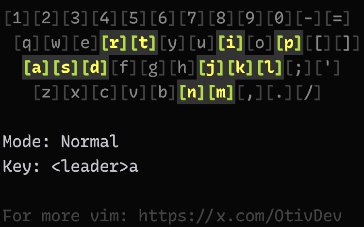
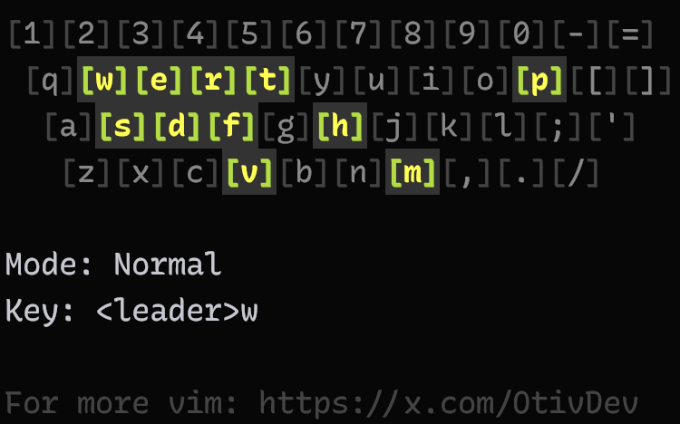
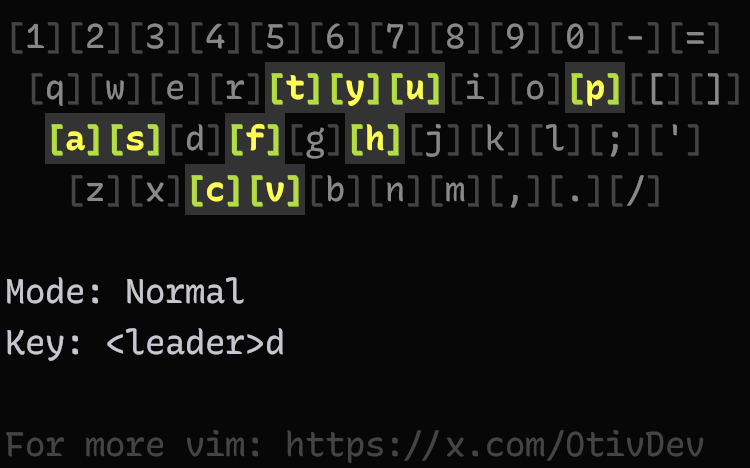
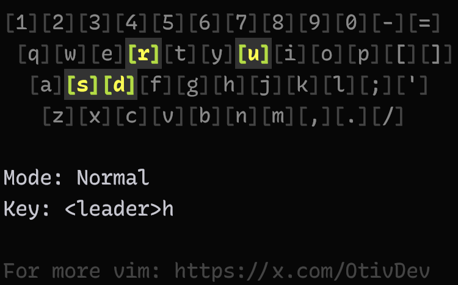
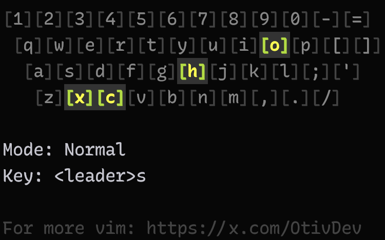

# nbr.keymap

A scope-based keymap system for modal editors that organizes mappings based on their contextual scope rather than by tool or function.

## Philosophy

Traditional modal editor keymaps typically organize bindings by tool (git, LSP, etc.) or function.

This system takes a different approach by organizing mappings based on their scope of operation:

```
<Scope><?Group><Operation>
```

- **Workspace** (`<leader>w`) - Operations affecting the entire workspace
- **Document** (`<leader>d`) - Operations on the current document
- **Symbol** (`<leader>s`) - Operations on code symbols
- **Hunks** (`<leader>h`) - Operations on code chunks/hunks
- **App** (`<leader>a`) - Application-level operations

## Design Principles

1. **Scope First**:

- Every operation must clearly belong to a specific scope (workspace, document, symbol)
- The scope should be immediately obvious from the operation's nature
- Operations affecting multiple scopes should be carefully considered

2. **Semantic Operations**:

- Mappings should represent clear, meaningful operations
- Focus on frequently used operations that benefit from quick access
- Operations should be distinct from basic editor commands
- Focus on what the operation means, not how it's implemented

3. **Tool & Editor Agnostic**:

- Mappings should be independent of specific tools or editors
- Use semantic terms (e.g., 'version' instead of 'git')
- Implementation details are left to the user's configuration

4. **Preserve Editor Defaults**:

- Don't replace basic editor operations with custom mappings
- Focus on operations that enhance rather than replace core functionality
- Leave common editor commands in their traditional form

5. **Consistent Patterns**:

- Second key should relate to the action within the scope
- Related operations should share the same scope
- Maintain predictable patterns across all mappings

6. **Single Source**:

- Each operation should have exactly one mapping
- Avoid duplicate mappings across different key combinations
- Choose the most appropriate and efficient mapping location

## Open Questions

- What about plugin related keymaps, which are sort of "extra" and do not belong in one of the categories?
  - For example `file-surfer.nvim` is not really a workspace switcher. Its just provides extra functionality to quick find a file in another workspace
  - Should we put it into `<leader>ad` to find a document in another workspace? It seems fitting, but this is only possible in Neovim

## Keymap

### `<leader>a` - App



> Screenshot by using [key-analzyer.nvim](https://github.com/meznaric/key-analyzer.nvim">key-analyzer.nvim)

| Keybinding   | Label                 | Description                                           | Notes              |
| ------------ | --------------------- | ----------------------------------------------------- | ------------------ |
| `<leader>ac` | `A`pp `A`ctions       | Show available app actions / commands                 |
| `<leader>an` | `A`pp `N`otifications | Show notifications                                    |
| `<leader>aw` | `A`pp `W`orkspace     | Open workspace                                        |
| `<leader>ad` | `A`pp `D`ocument      | Open document from workspace                          | `file-surfer.nvim` |
| `<leader>at` | `A`pp `T`hemes        | Switch theme or colorscheme                           |
| `<leader>ap` | `A`pp `P`lugins       | Manage plugins                                        |
| `<leader>al` | `A`pp `L`anguages     | Manage language servers                               |
| `<leader>as` | `A`pp `S`ettings      | Toggle app settings (background, line numbers, etc)   |
| `<leader>ai` | `A`pp `K`eybindings   | Show keybindings                                      |
| `<leader>aj` | `A`pp `J`umps         | Show application jump list                            | If available       |
| `<leader>ai` | `A`pp `I`nfo          | Show app information (formatter, lsp, linters, etc)   |
| `<leader>ar` | `A`pp `R`ecent        | Show recently visited documents accross all workspace |
| `<leader>af` | `A`pp `M`ode          | Focus / Zen Mode                                      | Group              |
| `<leader>ah` | `A`pp `H`elp          | Help Tags                                             | Group              |

### `<leader>w` - Workspace



| Keybinding    | Label                            | Description                         | Notes |
| ------------- | -------------------------------- | ----------------------------------- | ----- |
| `<leader>we`  | `W`orkspace `E`xplorer           | Open file explorer                  |
| `<leader>wp`  | `W`orkspace `P`roblems           | Show workspace diagnostics          |
| `<leader>wd`  | `W`orkspace `D`ocument           | Find document in workspace          |
| `<leader>wr`  | `W`orkspace `R`ecent             | Show recently visited documents     |
| `<leader>wm`  | `W`orkspace `M`odified           | Show modified files in workspace    |
| `<leader>wt`  | `W`orkspace `T`ext               | Find text in workspace              |
| `<leader>wf`  | `W`orkspace `F`ind               | Find and replace in workspace       |
| `<leader>ww`  | `W`orkspace `W`ord               | Find word under cursor in workspace |
| `<leader>ws`  | `W`orkspace `S`ymbol             | Find symbol in workspace            |
| `<leader>wh`  | `W`orkspace `H`istory            | Show version control history        |
| `<leader>wvb` | `W`orkspace `V`ersion `B`ranches | Show version branches               |
| `<leader>wvc` | `W`orkspace `V`ersion `C`ommits  | Show version commits                |
| `<leader>wvt` | `W`orkspace `V`ersion `T`ags     | Show version tags                   |

### `<leader>d` - Document



| Shortcut      | Label                         | Description                                | Notes          |
| ------------- | ----------------------------- | ------------------------------------------ | -------------- |
| `<leader>dp`  | `D`ocument `P`roblems         | Show document diagnostics                  |
| `<leader>dh`  | `D`ocument `H`istory          | Show document version history              |
| `<leader>dc`  | `D`ocument `C`hanges          | Show document changes (if available)       |
| `<leader>ds`  | `D`ocument `S`ymbol           | Find symbol in document                    |
| `<leader>dt`  | `D`ocument `T`ext             | Find text in document                      |
| `<leader>df`  | `D`ocument `F`ind             | Find and replace in document               |
| `<leader>dw`  | `D`ocument `W`ord             | Find word under cursor in document         |
| `<leader>db`  | `D`ocument `B`lame            | Show document blame information            |
| `<leader>da`  | `D`ocument `A`ssociated       | Find associated documents                  |
| `<leader>dl`  | `D`ocument `L`ast             | Switch to last document                    |
| `<leader>df`  | `D`ocument `F`ormat           | Format current document                    |
| `<leader>dy`  | `D`ocument `Y`ank property    | Copy document identifier (name, path, url) |
| `<leader>dA`  | `D`ocument `A`ll              | Select all document content                |
| `<leader>dY`  | `D`ocument `Y`ank All         | Copy all document content                  |
| `<leader>dvr` | `D`ocument `V`ersion `R`evert | Revert changes                             |
| `<leader>dvs` | `D`ocument `V`ersion `S`tage  | Stage changes                              |
| `<leader>dvu` | `D`ocument `V`ersion `U`tage  | Unstage changes                            |
| `<leader>du`  | `D`ocument `U`ndo             | Open undo tree                             | (if available) |

### `<leader>h` - Hunk



| Shortcut     | Label          | Description        | Notes |
| ------------ | -------------- | ------------------ | ----- |
| `<leader>hs` | `H`unk `S`tage | Stage current hunk |
| `<leader>hr` | `H`unk `R`eset | Reset current hunk |
| `<leader>hu` | `H`unk `U`ndo  | Undo staged hunk   |
| `<leader>hd` | `H`unk `D`iff  | Show hunk diff     |

### `<leader>s` - Symbol



| Shortcut     | Label                 | Description                 | Notes             |
| ------------ | --------------------- | --------------------------- | ----------------- |
| `<leader>sd` | `S`ymbol `D`efinition | Go to symbol definition     |
| `<leader>sr` | `S`ymbol `R`eferences | Show symbol references      |
| `<leader>sa` | `S`ymbol `A`ctions    | Show symbol actions         |
| `<leader>sn` | `S`ymbol `N`ame       | Rename symbol               |
| `<leader>sl` | `S`ymbol `L`log       | Insert log for symbol       |
| `<leader>si` | `S`ymbol `I`nfo       | Show symbol information     | Hover Information |
| `<leader>sI` | `S`ymbol `I`nspect    | Inspect symbol under cursor |

## Contributing

Feel free to:

- Suggest improvements to the scope organization
- Propose new scopes for uncovered contexts
- Share your adaptations for different editors

## License

MIT License - Feel free to adapt and use in your own configurations.
